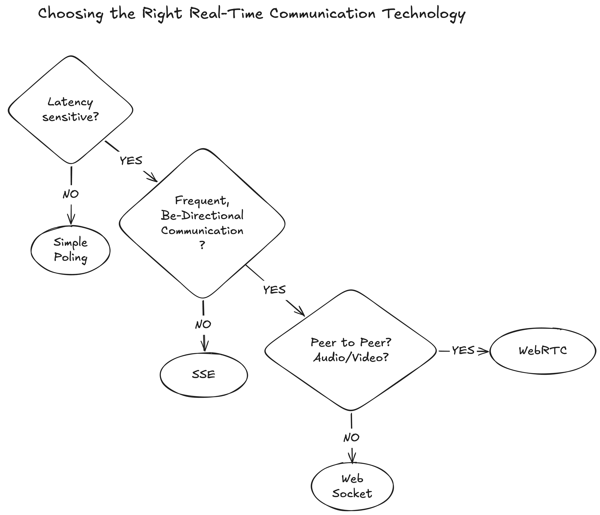

# Choosing the Right Real-Time Communication Technology

Real-time communication is a common requirement in modern distributed systems. 
Choosing the right technology depends on latency requirements, communication direction, and whether clients need to communicate directly with each other.

## Polling

Polling is the simplest approach where clients periodically request updates from the server.

**Use when:**
- Real-time updates are not critical
- Low complexity is preferred
- Update frequency is low

**Examples:**
- Order status checks
- Simple dashboards
- Periodic data refresh

**Trade-off:** Simple implementation but higher latency and unnecessary requests.

---

## Server-Sent Events (SSE)

SSE allows the server to push updates to the client over a persistent HTTP connection.

**Use when:**
- Communication is mainly one-way (server → client)
- Clients need live updates

**Examples:**
- Notifications
- Live feeds
- AI response streaming

**Trade-off:** Simpler than WebSocket but does not support bidirectional communication.

---

## WebSocket

WebSocket provides a persistent, bidirectional connection between client and server.

**Use when:**
- Low latency is required
- Both client and server need to exchange messages frequently

**Examples:**
- Chat applications
- Multiplayer games
- Collaborative tools

**Trade-off:** More complex infrastructure due to connection management and scaling challenges.

---

## WebRTC

WebRTC enables peer-to-peer communication, mainly optimized for real-time audio, video, and direct data exchange.

**Use when:**
- Clients need direct communication
- Ultra-low latency is required

**Examples:**
- Video conferencing
- Screen sharing
- Voice calls

**Trade-off:** Requires additional complexity such as signaling servers and NAT traversal handling.

---

## Quick Comparison

| Technology | Communication | Latency | Common Use Case |
|------------|---------------|---------|-----------------|
| Polling | Client → Server | High | Simple updates |
| SSE | Server → Client | Low | Notifications, streaming |
| WebSocket | Bidirectional | Very Low | Chat, games |
| WebRTC | Peer-to-peer | Ultra Low | Video/audio |

## Key Takeaway

Choose the simplest technology that satisfies your latency and communication requirements. 
Avoid using WebSocket or WebRTC when simpler solutions like SSE or polling are sufficient.
