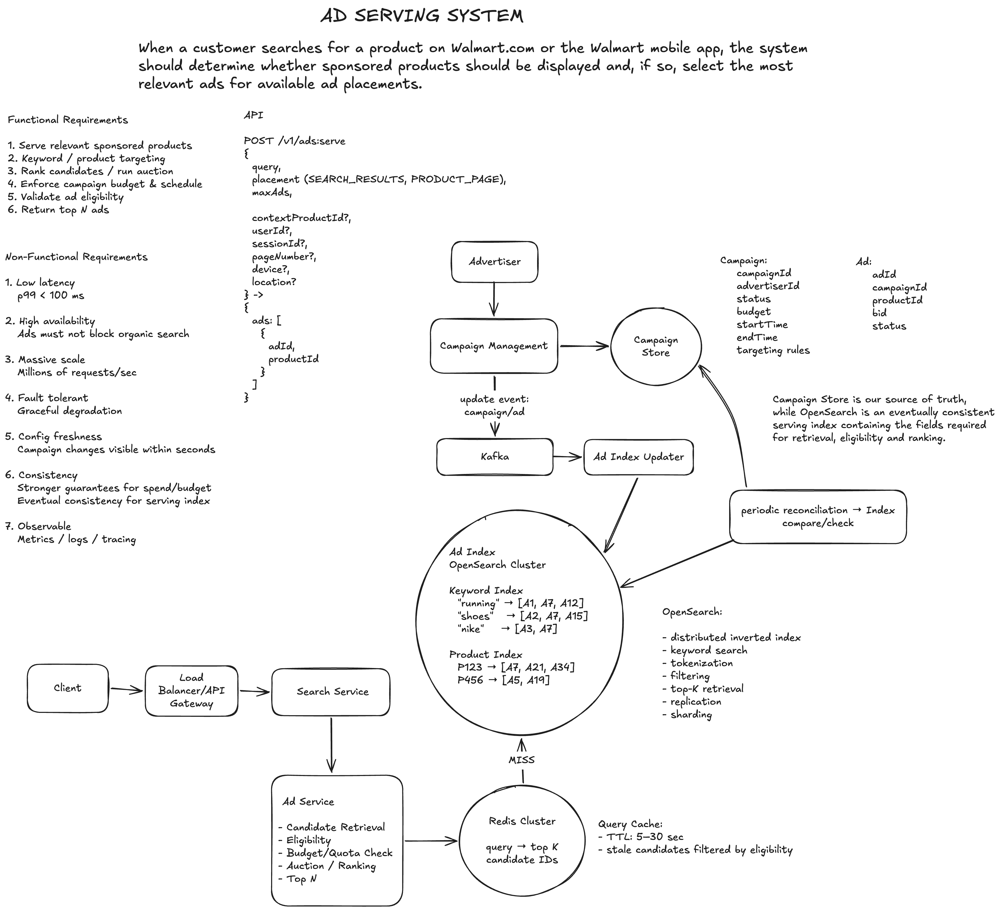

# Ad Serving System

High-level system design for a large-scale sponsored product advertising platform.

The system serves relevant sponsored products alongside organic search results while maintaining low latency, high availability, and horizontal scalability.

## Architecture



The original editable Excalidraw diagram is available here:

[ad-service.excalidraw](ad-service.excalidraw)

---

## Requirements

### Functional Requirements

- Serve relevant sponsored products
- Support keyword and product targeting
- Validate ad eligibility
- Enforce campaign budget and schedule
- Rank candidates / run an auction
- Return top N ads

### Non-Functional Requirements

- **Low latency:** p99 < 100 ms
- **High availability:** Ads must not block organic search
- **Massive scale:** Hundreds of thousands to millions of requests/sec
- **Fault tolerance:** Graceful degradation
- **Configuration freshness:** Campaign changes visible within seconds
- **Consistency:** Stronger guarantees for spend/budget; eventual consistency for serving index
- **Observability:** Metrics, logs, and distributed tracing

---

## API

```http
POST /v1/ads:serve/search
```

### Request

```json
{
  "query": "running shoes",
  "placement": "search_results",
  "userId": "user-123",
  "sessionId": "session-456",
  "pageNumber": 1,
  "device": "mobile",
  "location": "US"
}
```

### Response

```json
{
  "ads": [
    {
      "adId": "ad-123",
      "productId": "product-456"
    },
    {
      "adId": "ad-789",
      "productId": "product-012"
    }
  ]
}
```

---

## High-Level Design

### Control Plane

The control plane manages campaigns and keeps the serving index up to date.

```text
Advertiser
    |
    v
Campaign Management
    |
    v
Campaign Store
    |
    v
Kafka
    |
    v
Index Updater
    |
    v
OpenSearch
```

**Campaign Store** is the source of truth.

**OpenSearch** is the eventually consistent serving index.

Kafka provides asynchronous propagation of campaign and ad updates.

---

### Data Plane

```text
Client
   |
   v
Load Balancer
   |
   v
Search Service
   |
   v
Ad Service
   |
   v
Redis Query Cache
   |
   |-- HIT --> Candidates
   |
   |-- MISS --> OpenSearch
                    |
                    v
                Candidates
                    |
                    v
                 Ad Service
                    |
                    v
                Eligibility
                    |
                    v
                Budget / Quota
                    |
                    v
              Auction / Ranking
                    |
                    v
                  Top N
```

### Candidate Retrieval

Redis is used as a low-latency query cache.

```text
"running shoes" -> [A1, A7, A12]
"nike shoes"    -> [A3, A7]
```

On a cache miss, Ad Service queries OpenSearch.

The query cache uses a short TTL to limit stale results.

### Ad Index

OpenSearch contains distributed keyword and product indexes.

```text
Keyword Index

"running" -> [A1, A7, A12]
"shoes"   -> [A2, A7, A15]
"nike"    -> [A3, A7]
```

```text
Product Index

P123 -> [A7, A21, A34]
P456 -> [A5, A19]
```

The cluster uses sharding and replication for scale and availability.

---

## Scaling

- Search Service is stateless and horizontally scalable.
- Ad Service is stateless and horizontally scalable.
- Redis runs as a distributed cluster.
- OpenSearch runs as a distributed cluster with sharding and replication.
- Load balancing distributes traffic across service instances.

---

## Consistency

Campaign Store is authoritative.

Updates are propagated asynchronously:

```text
Campaign Store
      |
      v
    Kafka
      |
      v
Index Updater
      |
      v
OpenSearch
```

The update pipeline handles:

- Duplicate events through idempotency
- Out-of-order events through versioning
- Missed updates through periodic reconciliation

This provides low-latency updates while avoiding synchronous coordination on the serving path.

---

## Fault Tolerance

### Redis unavailable

Fall back to OpenSearch.

### OpenSearch unavailable

Return no sponsored products and allow organic search to continue.

### Ad Service unavailable

Search Service returns organic results without sponsored products.

The key principle is:

> **Ads are optional; organic search must remain available.**

---

## Key Design Decisions

### Redis + OpenSearch

Redis provides low-latency caching while OpenSearch provides the underlying distributed search index.

### Eventual Consistency

Strong consistency on every serving request would increase latency and reduce scalability.

The Campaign Store remains the source of truth while the serving index is eventually consistent.

### Budget / Quota

Local quota allocation avoids a synchronous budget check on every ad request while providing stronger control over campaign spend.

### Separation of Control and Data Planes

Campaign management and index updates are decoupled from the latency-sensitive serving path.

---

## Out of Scope

Impression and click tracking are intentionally outside this design.

They would be handled by a separate downstream event pipeline. The Ad Serving system only returns the identifiers required by downstream systems.

---

## Design Goals

The architecture prioritizes:

- Low latency
- Horizontal scalability
- High availability
- Graceful degradation
- Fast campaign propagation
- Controlled consistency
