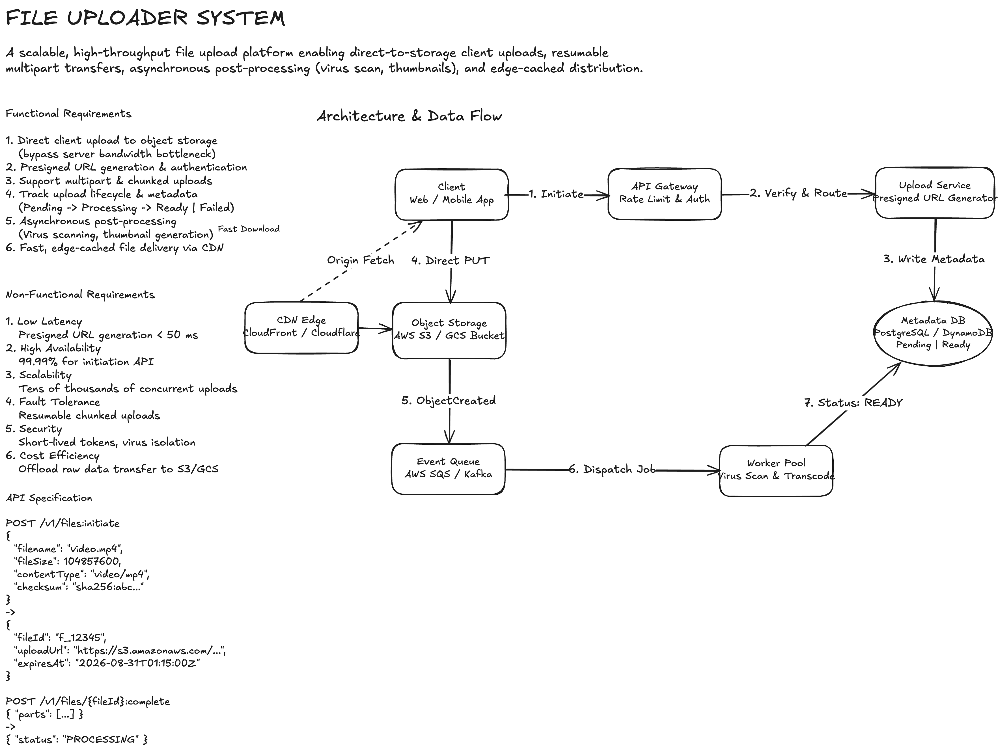

# Scalable File Upload System

A robust, horizontally scalable system design for uploading, processing, and distributing large files (images, videos, documents, and datasets) ranging from small assets up to several gigabytes.

The system uses **direct-to-storage multipart chunked uploads** to prevent API servers from becoming bandwidth or memory bottlenecks, asynchronous event-driven worker pipelines for heavy processing, and globally distributed CDN caching for fast downloads.

---

## Architecture Diagram



The original editable Excalidraw diagram is available here:

- **Interactive Web Canvas:** [file-uploader.excalidraw](https://excalidraw.com/#json=fUsBi1KjOCYzdjOih0HH5,LtZQ9A5fNoOw-UVswzAh_g)
- **Local File:** [file-uploader.excalidraw](file-uploader.excalidraw)

```text
[Client App] ────────(1. Initiate Upload)───────> [API Gateway]
   │                                                     │
   │                                              (Verify & Route)
   │                                                     ▼
   │ <─────(2. Presigned Part URLs)────────────── [Upload Service]
   │                                                     │
   │                                            (Write Metadata: PENDING)
   │                                                     ▼
   │                                            [Metadata Database]
   │                                                     ▲
   │ (3. Direct PUT Chunks in Parallel)                  │
   ▼                                                     │
[Object Storage (S3/GCS)] ──(4. ObjectCreated Event)──>  │
   │                                                     │
   │                                                     ▼
   │                                              [Event Queue (SQS)]
   │                                                     │
   │                                              (5. Dispatch Job)
   │                                                     ▼
   │ <──────────(6. Mark Status: READY)────────── [Worker Pool]
   ▲                                              (Virus Scan & Resizing)
   │ (Origin Fetch)
[CDN Edge (CloudFront)] <──────── (Fast Downloads)
```

---

## Requirements

### Functional Requirements

1. **Direct Uploads:** Client uploads raw file bytes directly to object storage without routing binary data through application servers.
2. **Support for Large Files & Chunks:** Split files > 100 MB into chunks (multipart upload) up to 5 TB.
3. **Resumability:** If an upload is interrupted, the client only retries failed chunks rather than restarting the entire file.
4. **Metadata Management:** Track file metadata (`fileName`, `fileSize`, `mimeType`, `checksum`, `uploadStatus`).
5. **Asynchronous Post-Processing:** Automatically trigger virus scanning, thumbnail generation, video transcoding, and metadata extraction once the upload completes.
6. **Fast Downloads:** Deliver files to end users with low latency using edge caching (CDN).

### Non-Functional Requirements

- **High Availability:** 99.99% availability for upload initialization and status APIs.
- **Low Latency:** URL generation and metadata queries must resolve in $< 50\text{ ms}$.
- **Massive Scalability:** Handle tens of thousands of concurrent uploads without saturating application server bandwidth.
- **Data Integrity:** Verify payload integrity end-to-end using SHA-256 / MD5 checksums per chunk.
- **Security:** Strict authorization, short-lived presigned URLs, and virus isolation quarantine.
- **Cost Efficiency:** Offload high-bandwidth ingress and storage to dedicated cloud object storage rather than high-cost compute instances.

---

## API Specification

### 1. Initiate Upload

Requests permission to upload a file and creates a tracking record.

```http
POST /v1/files:initiate
Content-Type: application/json
```

**Request:**

```json
{
  "filename": "annual_presentation.mp4",
  "fileSize": 524288000,
  "contentType": "video/mp4",
  "checksum": "sha256:e3b0c44298fc1c149afbf4c8996fb92427ae41e4649b934ca495991b7852b855",
  "isMultipart": true,
  "chunkCount": 25
}
```

**Response:**

```json
{
  "fileId": "file_8f29ab4e",
  "uploadId": "s3_upload_id_77a9c1",
  "status": "PENDING",
  "parts": [
    {
      "partNumber": 1,
      "uploadUrl": "https://s3.us-east-1.amazonaws.com/uploads/file_8f29ab4e?partNumber=1&uploadId=...&X-Amz-Signature=...",
      "expiresAt": "2026-08-31T02:00:00Z"
    },
    {
      "partNumber": 2,
      "uploadUrl": "https://s3.us-east-1.amazonaws.com/uploads/file_8f29ab4e?partNumber=2&uploadId=...&X-Amz-Signature=...",
      "expiresAt": "2026-08-31T02:00:00Z"
    }
  ]
}
```

---

### 2. Complete Upload

Notifies the system that all parts have been uploaded to object storage so they can be assembled.

```http
POST /v1/files/{fileId}:complete
Content-Type: application/json
```

**Request:**

```json
{
  "uploadId": "s3_upload_id_77a9c1",
  "parts": [
    { "partNumber": 1, "eTag": "\"d41d8cd98f00b204e9800998ecf8427e\"" },
    { "partNumber": 2, "eTag": "\"6a8277a063b30abb80d44c941e30d77c\"" }
  ]
}
```

**Response:**

```json
{
  "fileId": "file_8f29ab4e",
  "status": "PROCESSING",
  "message": "File assembly initiated. Downstream workers dispatched."
}
```

---

### 3. Get File Status

Allows the client to poll or check status (or receive updates via WebSocket / Server-Sent Events).

```http
GET /v1/files/{fileId}
```

**Response:**

```json
{
  "fileId": "file_8f29ab4e",
  "filename": "annual_presentation.mp4",
  "fileSize": 524288000,
  "status": "READY",
  "downloadUrl": "https://cdn.example.com/files/file_8f29ab4e.mp4",
  "thumbnails": [
    "https://cdn.example.com/files/file_8f29ab4e_thumb_320x180.jpg"
  ]
}
```

---

## Detailed System Operation

### Step 1: Upload Initiation & Metadata Storage
1. The client calculates the total file size and checksum (SHA-256 / MD5).
2. It sends `POST /v1/files:initiate` through the **API Gateway** (which validates JWT authentication and applies rate limiting).
3. The **Upload Service** calls AWS S3 `CreateMultipartUpload` to get an `uploadId`.
4. It persists an entry in the **Metadata DB** (PostgreSQL or DynamoDB) with:
   - `fileId`, `userId`, `filename`, `fileSize`, `contentType`, `s3Key`
   - `status = PENDING`
5. The service generates presigned S3 URLs for each part (with an expiration of 30–60 minutes) and returns them to the client.

### Step 2: Direct Client-to-Storage Upload
1. The client splits the local file into chunks in memory/disk.
2. The client opens concurrent HTTP `PUT` requests (typically 3–5 parallel connections) directly to AWS S3 using the presigned URLs.
3. S3 returns an `ETag` (hash) in the response headers for each successfully uploaded chunk.
4. If an individual chunk fails due to a network drop, the client retries **only that chunk** using exponential backoff.

### Step 3: Finalization & Assembly
1. Once all chunks return success, the client sends `POST /v1/files/{fileId}:complete` with the list of part numbers and their corresponding `ETag` values.
2. The Upload Service calls S3 `CompleteMultipartUpload`. S3 atomically stitches the parts into a single stored object.
3. The Metadata DB record status transitions to `PROCESSING`.

### Step 4: Asynchronous Processing Pipeline
1. S3 emits an `ObjectCreated` event to an **Event Queue** (AWS SQS or Kafka).
2. **Worker Pool instances** poll tasks from the queue:
   - **Virus Scanner:** Scans the raw binary using ClamAV or a third-party engine. Malicious files are immediately moved to a quarantine bucket and marked `FAILED_QUARANTINE`.
   - **Media Processing:** Generates responsive thumbnails, extracts EXIF/ID3 metadata, or dispatches transcoding jobs.
3. Upon successful processing, the worker updates the Metadata DB record status to `READY`.

### Step 5: Edge-Cached Distribution
1. When a user requests a file, the client queries `GET /v1/files/{fileId}` to obtain the public or signed CDN URL.
2. The download request hits the **CDN Edge (CloudFront / Cloudflare)**:
   - **Cache Hit:** File is served directly from the nearest edge location with minimal latency.
   - **Cache Miss:** CDN fetches the file from the S3 origin bucket, caches it, and streams it to the user.

---

## Large File & Chunking Strategy Deep Dive

### 1. Chunk Sizing Heuristics
- **Minimum Part Size (S3 standard):** 5 MB (except the final part).
- **Recommended Sizing:**
  - Files $100\text{ MB} - 1\text{ GB}$: **5 MB to 10 MB chunks**.
  - Files $1\text{ GB} - 50\text{ GB}$: **25 MB to 50 MB chunks**.
  - S3 supports up to 10,000 parts per multipart upload (maximum 5 TB total file size).

### 2. Client Concurrency Control
Uploading 50 chunks simultaneously would saturate client uplink bandwidth and exhaust mobile battery life. The client implements a bounded worker pool:
- **Concurrency limit:** 3 to 5 simultaneous HTTP PUT streams.
- **Adaptive chunking:** On high-latency or mobile networks, the client throttles concurrency down to 2 streams to minimize bufferbloat.

### 3. Checksums and Data Integrity
- Each chunk request includes a `Content-MD5` header. S3 compares the uploaded bytes to the header on arrival; if corrupted in transit, S3 rejects the chunk immediately.
- When `CompleteMultipartUpload` runs, S3 calculates a composite checksum across all parts, ensuring the assembled object matches the original binary.

---

## Fault Tolerance & Edge Cases

| Failure Scenario | Mitigation Strategy |
| :--- | :--- |
| **Network Disconnection** | The client maintains a local upload progress state (`fileId`, completed parts). When reconnected, it resumes uploading remaining parts without restarting from byte 0. |
| **Expired Presigned URL** | If an upload takes longer than the URL TTL (e.g. 1 hour on slow networks), the client calls `POST /v1/files/{fileId}:refresh-urls` to obtain fresh presigned tokens for remaining chunks. |
| **Zombie / Abandoned Uploads** | If a user closes the browser midway, incomplete chunks still incur storage costs in S3. An **S3 Lifecycle Rule** (`AbortIncompleteMultipartUpload`) automatically purges incomplete uploads after 7 days. |
| **Malicious Payloads** | Raw uploads are isolated in an unlisted ingress bucket. Files are only moved to the public/CDN-accessible bucket after passing virus scanning and validation. |

---

## Key Design Decisions

1. **Direct-to-S3 vs. Proxying Through API Servers:**
   - *Decision:* Direct client-to-storage via Presigned URLs.
   - *Rationale:* Streaming 10 GB video uploads through our API instances would saturate network interface cards (NICs), consume server memory buffers, and require enormous horizontal server scaling. S3 handles ingress scaling out-of-the-box.
2. **Asynchronous Queue vs. Synchronous Worker Calls:**
   - *Decision:* Decouple upload completion from media processing using AWS SQS / Kafka.
   - *Rationale:* Heavy workloads (transcoding, scanning) vary in duration. A queue provides automatic buffering during traffic spikes and prevents worker outages from blocking client upload confirmations.
3. **Stateless Upload Service:**
   - *Decision:* The upload service holds zero local file state in memory or disk.
   - *Rationale:* Enables instant horizontal auto-scaling and zero-downtime rolling deployments.
